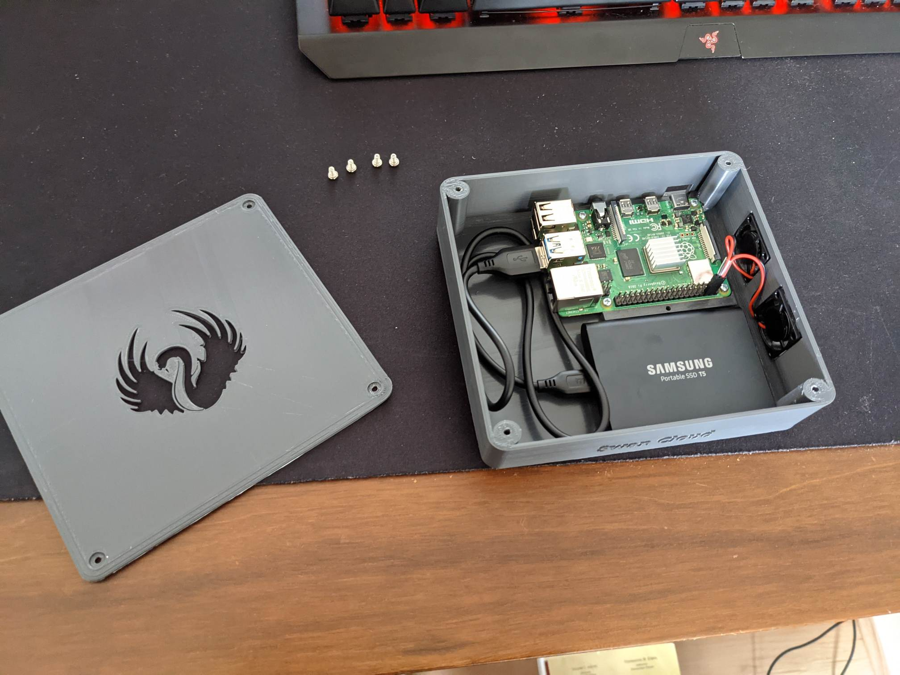
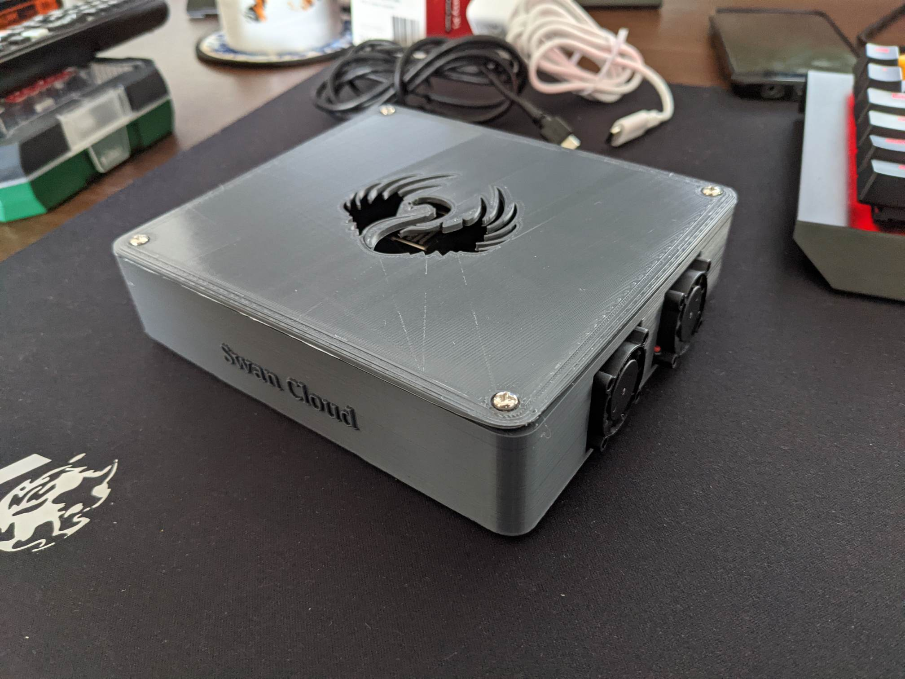
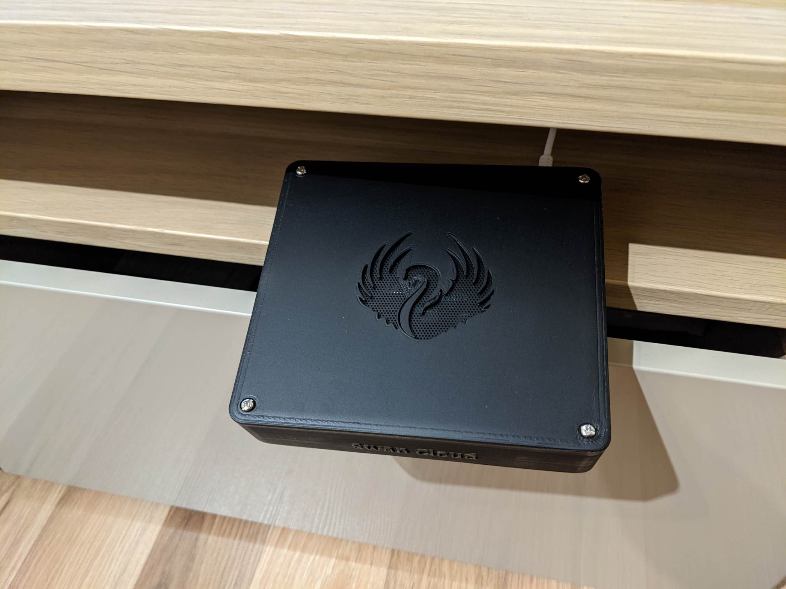

# Raspberry Pi 3/4 Case Single 2.5drive

Find in this folder the designs for an Rpi case. This will work with both Rpi 3 and 4 and you can use any 2.5 drive hdd or ssd with the pi.

# Recommended 3D Printer Settings

These settings have been tested on an Ender 3 with a Prima Value Dark Grey fillament.

- Printing Temp: 200c
- Plate Temp: 60c
- Plate Adhesion Type: Brim/Raft (because its a big print it tends to bend so use a raft if brim doesnt help)
- Initial Layer Speed: 20mm/s
- Print Speed: 50-60mm/s

# Images

